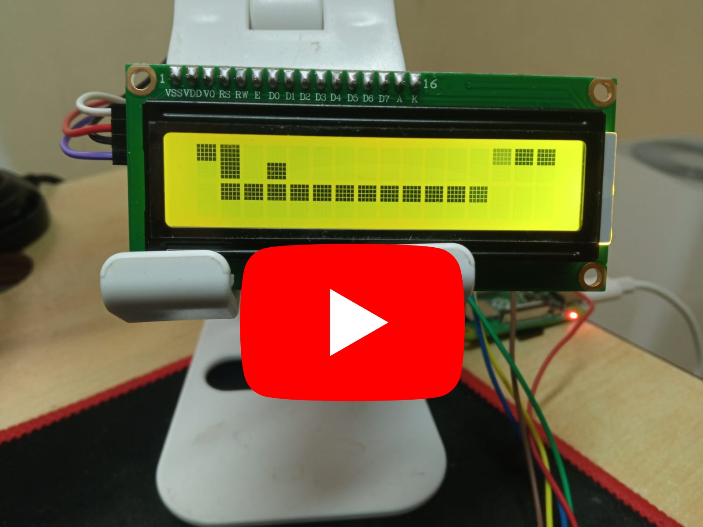

# Raspberry Pi Snake

A college embedded-systems project that turns Snake into a playable Raspberry Pi prototype with a character LCD and physical buttons.

This project combines Python, GPIO input, and a 1602A LCD display to create a physical version of Snake. The player controls the snake using four buttons, the LCD shows gameplay and menu states, and the project stores settings and high scores between runs.

To make the game playable on a constrained character display, the code uses custom LCD characters to simulate extra display rows for the snake board.

For setup, configuration, and implementation details, see [TECHNICAL.md](TECHNICAL.md).

## What This Demonstrates

- Hardware-software integration in a real physical prototype
- Python game logic built around Raspberry Pi GPIO input
- LCD rendering under tight display constraints using custom characters
- Menu-driven gameplay settings and persistent high-score storage
